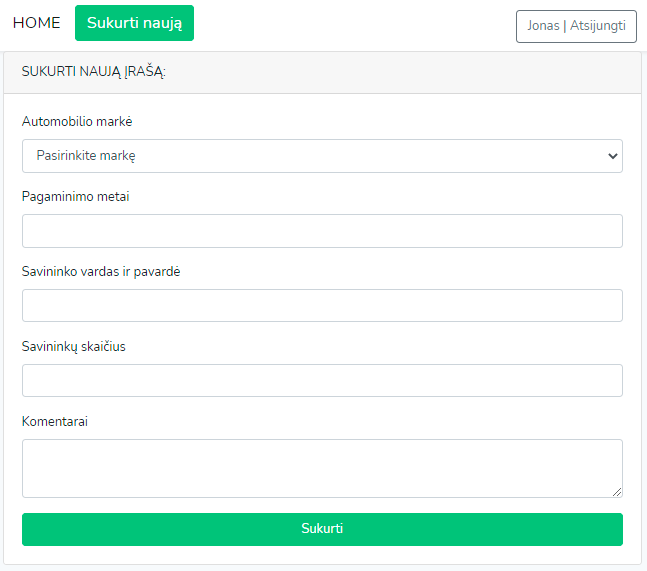

<h1 align="center">Laravel-Truck-Management-System

(Sunkvežimių valdymo sistema)</h1>


### **Project features**
- List all trucks
- Create new trucks and assign properties to them
- Filter trucks by their properties (owner's names & surnames, car make, year of manufacture, ownerships and comments)
- Login panel (only registered users can view data and create new items)
- AJAX functionality
    + Sort trucks and their properties by ascending descending values
    + Select a number of items displayed per page (10, 20, 50 or 100)
    + Search bar
    + Results auto-loading
    + Custom logout panel

## **Packages:**
- [Laravel Form Builder](https://github.com/kristijanhusak/laravel-form-builder) 
```sh
composer require kris/laravel-form-builder
```
- [Yajra DataTables](https://github.com/yajra/laravel-datatables/)
```sh
composer require yajra/laravel-datatables-oracle:"~9.0"
```
- [Laravel / UI](https://github.com/laravel/ui) 
```sh
composer require laravel/ui
```

### Prerequisites
|  Follow links below to download: |
| ------------- |
| Git (https://git-scm.com/downloads)      | 
| Composer (https://getcomposer.org/download) |  

### Installation
1. Clone the repository or dl .zip package
2. Use XAMPP, AMPPS or other open-source platform to launch a php interpreter
3. Open it with Visual Studio Code or your preferred code editor.
4. Create a new schema in your MySQL server.
5. Rename **'.env.example'** file to **'.env'** inside of the project's root directory and configure the database information.
> *Note: DB_DATABASE field value should match the name of the schema.*
6. Install missing Laravel dependencies running bash cmd in your code editor terminal:
```sh
composer install
```
7. Run Bash cmd  to generate new Laravel application key value:
```sh
php artisan key:generate
```
8. Run Bash cmd to import tables into SQL database:
```sh
php artisan migrate
```
9. Run Bash cmd to fill **Brands** table with dataset:
```sh
php artisan db:seed
```
10. Run Bash cmd to fill **Trucks** table with dataset:
```sh
php artisan db:seed --class=TruckSeeder
```
10. Run Bash cmd to open PHP's built-in development server and click on the newly generated link to open the application (e.g http://127.0.0.1:8000):
```sh
php artisan serve
```
### Application UI
<hr>

<hr>

<hr>

<hr>

## Authors
[Jonas Dudonis](https://github.com/JonasDudonis)
<br>
<a href="https://www.linkedin.com/in/jonasdudonis" target="_blank"></a> 